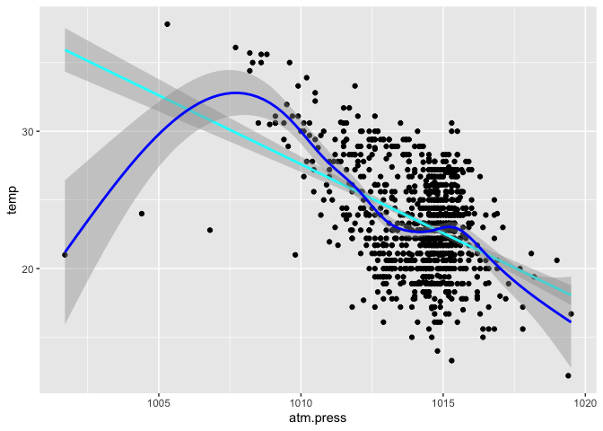
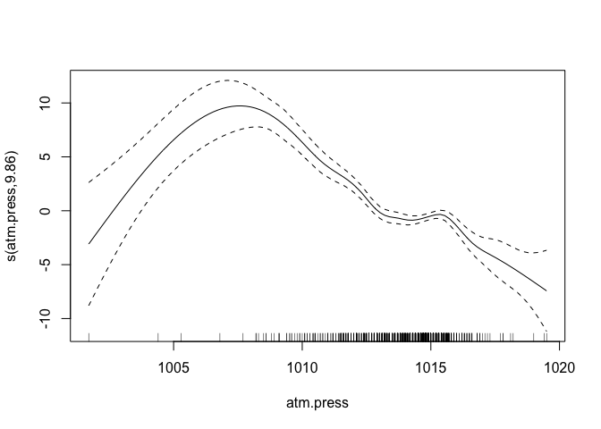

Lab 05 - Data Wrangling
================

# Learning goals

- Use the `merge()` function to join two datasets.
- Deal with missings and impute data.
- Identify relevant observations using `quantile()`.
- Practice your GitHub skills.

# Lab description

For this lab we will be dealing with the meteorological dataset `met`.
In this case, we will use `data.table` to answer some questions
regarding the `met` dataset, while at the same time practice your
Git+GitHub skills for this project.

This markdown document should be rendered using `github_document`
document.

# Part 1: Setup a Git project and the GitHub repository

1.  Go to wherever you are planning to store the data on your computer,
    and create a folder for this project

2.  In that folder, save [this
    template](https://github.com/JSC370/JSC370-2025/blob/main/labs/lab05/lab05-wrangling-gam.Rmd)
    as “README.Rmd”. This will be the markdown file where all the magic
    will happen.

3.  Go to your GitHub account and create a new repository of the same
    name that your local folder has, e.g., “JSC370-labs”.

4.  Initialize the Git project, add the “README.Rmd” file, and make your
    first commit.

5.  Add the repo you just created on GitHub.com to the list of remotes,
    and push your commit to origin while setting the upstream.

Most of the steps can be done using command line:

``` sh
# Step 1
cd ~/Documents
mkdir JSC370-labs
cd JSC370-labs

# Step 2
wget https://raw.githubusercontent.com/JSC370/jsc370-2023/main/labs/lab05/lab05-wrangling-gam.Rmd
mv lab05-wrangling-gam.Rmd README.Rmd
# if wget is not available,
curl https://raw.githubusercontent.com/JSC370/jsc370-2023/main/labs/lab05/lab05-wrangling-gam.Rmd --output README.Rmd

# Step 3
# Happens on github

# Step 4
git init
git add README.Rmd
git commit -m "First commit"

# Step 5
git remote add origin git@github.com:[username]/JSC370-labs
git push -u origin master
```

You can also complete the steps in R (replace with your paths/username
when needed)

``` r
# Step 1
setwd("~/Documents")
dir.create("JSC370-labs")
setwd("JSC370-labs")

# Step 2
download.file(
  "https://raw.githubusercontent.com/JSC370/jsc370-2023/main/labs/lab05/lab05-wrangling-gam.Rmd",
  destfile = "README.Rmd"
  )

# Step 3: Happens on Github

# Step 4
system("git init && git add README.Rmd")
system('git commit -m "First commit"')

# Step 5
system("git remote add origin git@github.com:[username]/JSC370-labs")
system("git push -u origin master")
```

Once you are done setting up the project, you can now start working with
the MET data.

## Setup in R

1.  Load the `data.table` (and the `dtplyr` and `dplyr` packages).

``` r
library(data.table)
library(tidyverse)
```

    ## ── Attaching core tidyverse packages ──────────────────────── tidyverse 2.0.0 ──
    ## ✔ dplyr     1.1.4     ✔ readr     2.1.5
    ## ✔ forcats   1.0.0     ✔ stringr   1.5.1
    ## ✔ ggplot2   3.5.1     ✔ tibble    3.2.1
    ## ✔ lubridate 1.9.3     ✔ tidyr     1.3.1
    ## ✔ purrr     1.0.2     
    ## ── Conflicts ────────────────────────────────────────── tidyverse_conflicts() ──
    ## ✖ dplyr::between()     masks data.table::between()
    ## ✖ dplyr::filter()      masks stats::filter()
    ## ✖ dplyr::first()       masks data.table::first()
    ## ✖ lubridate::hour()    masks data.table::hour()
    ## ✖ lubridate::isoweek() masks data.table::isoweek()
    ## ✖ dplyr::lag()         masks stats::lag()
    ## ✖ dplyr::last()        masks data.table::last()
    ## ✖ lubridate::mday()    masks data.table::mday()
    ## ✖ lubridate::minute()  masks data.table::minute()
    ## ✖ lubridate::month()   masks data.table::month()
    ## ✖ lubridate::quarter() masks data.table::quarter()
    ## ✖ lubridate::second()  masks data.table::second()
    ## ✖ purrr::transpose()   masks data.table::transpose()
    ## ✖ lubridate::wday()    masks data.table::wday()
    ## ✖ lubridate::week()    masks data.table::week()
    ## ✖ lubridate::yday()    masks data.table::yday()
    ## ✖ lubridate::year()    masks data.table::year()
    ## ℹ Use the conflicted package (<http://conflicted.r-lib.org/>) to force all conflicts to become errors

``` r
library(dtplyr)
library(dplyr)
library(leaflet)
library(kableExtra)
```

    ## 
    ## Attaching package: 'kableExtra'
    ## 
    ## The following object is masked from 'package:dplyr':
    ## 
    ##     group_rows

``` r
library(mgcv)
```

    ## Loading required package: nlme
    ## 
    ## Attaching package: 'nlme'
    ## 
    ## The following object is masked from 'package:dplyr':
    ## 
    ##     collapse
    ## 
    ## This is mgcv 1.9-1. For overview type 'help("mgcv-package")'.

2.  Load the met data from
    <https://raw.githubusercontent.com/JSC370/JSC370-2024/main/data/met_all_2023.gz>,
    and also the station data. For the latter, you can use the code we
    used during lecture to pre-process the stations data:

``` r
# Download the data
stations <- fread("ftp://ftp.ncdc.noaa.gov/pub/data/noaa/isd-history.csv")
stations[, USAF := as.integer(USAF)]
```

    ## Warning in eval(jsub, SDenv, parent.frame()): NAs introduced by coercion

``` r
# Dealing with NAs and 999999
stations[, USAF   := fifelse(USAF == 999999, NA_integer_, USAF)]
stations[, CTRY   := fifelse(CTRY == "", NA_character_, CTRY)]
stations[, STATE  := fifelse(STATE == "", NA_character_, STATE)]

# Selecting the three relevant columns, and keeping unique records
stations <- unique(stations[, list(USAF, CTRY, STATE)])

# Dropping NAs
stations <- stations[!is.na(USAF)]

# Removing duplicates
stations[, n := 1:.N, by = .(USAF)]
stations <- stations[n == 1,][, n := NULL]
```

``` r
# Read in the met data
download.file(
  "https://raw.githubusercontent.com/JSC370/JSC370-2025/main/data/met/met_all.gz",
  destfile = "met_all.gz",
  method = "curl",
  timeout = 60
)
met = data.table::fread("met_all.gz")
```

3.  Merge the data as we did during the lecture. Use the `merge()` code
    and you can also try the tidy way with `left_join()`

``` r
met = merge(
  x=met,
  y=stations,
  all.x=TRUE,
  all.y=FALSE,
  by.x="USAFID",
  by.y="USAF"
)
head(met)
```

    ## Key: <USAFID>
    ##    USAFID  WBAN  year month   day  hour   min   lat      lon  elev wind.dir
    ##     <int> <int> <int> <int> <int> <int> <int> <num>    <num> <int>    <int>
    ## 1: 690150 93121  2019     8     1     0    56  34.3 -116.166   696      220
    ## 2: 690150 93121  2019     8     1     1    56  34.3 -116.166   696      230
    ## 3: 690150 93121  2019     8     1     2    56  34.3 -116.166   696      230
    ## 4: 690150 93121  2019     8     1     3    56  34.3 -116.166   696      210
    ## 5: 690150 93121  2019     8     1     4    56  34.3 -116.166   696      120
    ## 6: 690150 93121  2019     8     1     5    56  34.3 -116.166   696       NA
    ##    wind.dir.qc wind.type.code wind.sp wind.sp.qc ceiling.ht ceiling.ht.qc
    ##         <char>         <char>   <num>     <char>      <int>         <int>
    ## 1:           5              N     5.7          5      22000             5
    ## 2:           5              N     8.2          5      22000             5
    ## 3:           5              N     6.7          5      22000             5
    ## 4:           5              N     5.1          5      22000             5
    ## 5:           5              N     2.1          5      22000             5
    ## 6:           9              C     0.0          5      22000             5
    ##    ceiling.ht.method sky.cond vis.dist vis.dist.qc vis.var vis.var.qc  temp
    ##               <char>   <char>    <int>      <char>  <char>     <char> <num>
    ## 1:                 9        N    16093           5       N          5  37.2
    ## 2:                 9        N    16093           5       N          5  35.6
    ## 3:                 9        N    16093           5       N          5  34.4
    ## 4:                 9        N    16093           5       N          5  33.3
    ## 5:                 9        N    16093           5       N          5  32.8
    ## 6:                 9        N    16093           5       N          5  31.1
    ##    temp.qc dew.point dew.point.qc atm.press atm.press.qc       rh   CTRY  STATE
    ##     <char>     <num>       <char>     <num>        <int>    <num> <char> <char>
    ## 1:       5      10.6            5    1009.9            5 19.88127     US     CA
    ## 2:       5      10.6            5    1010.3            5 21.76098     US     CA
    ## 3:       5       7.2            5    1010.6            5 18.48212     US     CA
    ## 4:       5       5.0            5    1011.6            5 16.88862     US     CA
    ## 5:       5       5.0            5    1012.7            5 17.38410     US     CA
    ## 6:       5       5.6            5    1012.7            5 20.01540     US     CA

``` r
# tidyverse version
met = left_join(
  x = met,
  y = stations,
  by = c("USFID" = "USAF")
)
```

## Question 1: Representative station for the US

Across all weather stations, what stations have the median values of
temperature, wind speed, and atmospheric pressure? Using the
`quantile()` function, identify these three stations. Do they coincide?

1)  median values of temperature, wind speed, and atmospheric pressure
    DONE

``` r
medians = met[, .(
  temp_50 = quantile(temp, probs=.5, na.rm=TRUE),
  wind.sp_50 = quantile(wind.sp, probs=.5, na.rm=TRUE),
  atm.press_50 = quantile(atm.press, probs=.5, na.rm=TRUE)
)]
medians
```

    ##    temp_50 wind.sp_50 atm.press_50
    ##      <num>      <num>        <num>
    ## 1:    23.5        2.1       1014.1

2)  

``` r
station_med = met[, .(
  temp = quantile(temp, probs=.5, na.rm=TRUE),
  wind.sp = quantile(wind.sp, probs=.5, na.rm=TRUE),
  atm.press = quantile(atm.press, probs=.5, na.rm=TRUE),
  lat = mean(lat, na.rm = TRUE),
  lon = mean(lon, na.rm = TRUE)
), by = .(USAFID, STATE)]
station_med
```

    ##       USAFID  STATE  temp wind.sp atm.press      lat       lon
    ##        <int> <char> <num>   <num>     <num>    <num>     <num>
    ##    1: 690150     CA  32.8     3.1   1010.50 34.29982 -116.1658
    ##    2: 720110     TX  31.0     2.1        NA 30.78400  -98.6620
    ##    3: 720113     MI  23.2     2.6        NA 42.54300  -83.1780
    ##    4: 720120     SC  27.0     2.6        NA 32.21746  -80.6998
    ##    5: 720137     IL  22.0     1.5        NA 41.42500  -88.4190
    ##   ---                                                         
    ## 1591: 726777     MT  18.3     4.6   1014.30 46.35792 -104.2501
    ## 1592: 726797     MT  18.3     2.6   1015.20 45.78795 -111.1600
    ## 1593: 726798     MT  19.0     4.1   1014.30 45.69800 -110.4400
    ## 1594: 726810     ID  25.0     3.1   1011.10 43.56700 -116.2390
    ## 1595: 726813     ID  22.8     2.1   1011.75 43.64963 -116.6331

3)  

``` r
# now we can find the stations that are closest to these median temperature stations
station_med[, temp_dist := abs(temp - medians$temp_50)]
median_temp_station = station_med[temp_dist == 0]
median_temp_station
```

    ##    USAFID  STATE  temp wind.sp atm.press      lat       lon temp_dist
    ##     <int> <char> <num>   <num>     <num>    <num>     <num>     <num>
    ## 1: 720501     VA  23.5     1.5        NA 37.85000 -76.88300         0
    ## 2: 722031     AL  23.5     0.0        NA 34.26900 -86.85800         0
    ## 3: 722148     NC  23.5     0.0        NA 35.41700 -80.15100         0
    ## 4: 723055     NC  23.5     0.0        NA 35.76500 -80.95687         0
    ## 5: 723067     NC  23.5     1.5        NA 35.31801 -77.63127         0
    ## 6: 723177     NC  23.5     0.0        NA 36.46000 -80.55300         0
    ## 7: 725564     NE  23.5     2.6        NA 41.44900 -96.52000         0

``` r
# median wind.sp stations
station_med[, wind.sp_dist := abs(wind.sp - medians$wind.sp_50)]
median_wind.sp_station = station_med[wind.sp_dist == 0]
median_wind.sp_station
```

    ##      USAFID  STATE  temp wind.sp atm.press      lat       lon temp_dist
    ##       <int> <char> <num>   <num>     <num>    <num>     <num>     <num>
    ##   1: 720110     TX  31.0     2.1        NA 30.78400  -98.6620       7.5
    ##   2: 720258     MN  17.0     2.1        NA 46.61900  -93.3100       6.5
    ##   3: 720266     IN  21.0     2.1        NA 41.27500  -85.8400       2.5
    ##   4: 720272     WA  18.0     2.1        NA 48.46717 -122.4162       5.5
    ##   5: 720273     TX  28.6     2.1        NA 28.97300  -95.8630       5.1
    ##  ---                                                                   
    ## 339: 726583     MN  21.0     2.1        NA 45.14115  -94.5070       2.5
    ## 340: 726589     MN  20.0     2.1        NA 43.68286  -93.3670       3.5
    ## 341: 726603     MN  20.7     2.1        NA 44.85700  -93.0330       2.8
    ## 342: 726626     WI  16.6     2.1        NA 45.15400  -89.1110       6.9
    ## 343: 726813     ID  22.8     2.1   1011.75 43.64963 -116.6331       0.7
    ##      wind.sp_dist
    ##             <num>
    ##   1:            0
    ##   2:            0
    ##   3:            0
    ##   4:            0
    ##   5:            0
    ##  ---             
    ## 339:            0
    ## 340:            0
    ## 341:            0
    ## 342:            0
    ## 343:            0

``` r
# median atm.press stations
station_med[, atm.press_dist := abs(atm.press - medians$atm.press_50)]
median_atm.press_station = station_med[atm.press_dist == 0]
median_atm.press_station
```

    ##     USAFID  STATE  temp wind.sp atm.press      lat        lon temp_dist
    ##      <int> <char> <num>   <num>     <num>    <num>      <num>     <num>
    ##  1: 722420     TX  30.0     4.6    1014.1 29.27298  -94.85900       6.5
    ##  2: 723830     CA  23.3     5.1    1014.1 34.74468 -118.72504       0.2
    ##  3: 724885     NV  24.7     2.6    1014.1 39.41700 -118.71577       1.2
    ##  4: 724940     CA  18.9     5.1    1014.1 37.61960 -122.36669       4.6
    ##  5: 725376     MI  22.8     3.1    1014.1 42.23315  -83.53291       0.7
    ##  6: 725975     OR  16.1     2.1    1014.1 42.60000 -123.36400       7.4
    ##  7: 726183     ME  18.9     0.0    1014.1 43.99100  -70.94800       4.6
    ##  8: 726375     MI  21.1     3.1    1014.1 42.66500  -83.41801       2.4
    ##  9: 726579     MN  20.0     3.1    1014.1 44.83199  -93.47097       3.5
    ## 10: 726584     MN  20.0     3.1    1014.1 44.93200  -93.05600       3.5
    ## 11: 726590     SD  20.0     3.1    1014.1 45.44377  -98.41344       3.5
    ##     wind.sp_dist atm.press_dist
    ##            <num>          <num>
    ##  1:          2.5              0
    ##  2:          3.0              0
    ##  3:          0.5              0
    ##  4:          3.0              0
    ##  5:          1.0              0
    ##  6:          0.0              0
    ##  7:          2.1              0
    ##  8:          1.0              0
    ##  9:          1.0              0
    ## 10:          1.0              0
    ## 11:          1.0              0

``` r
# Do they coincide? - Answer: no
merged = median_temp_station |>
  inner_join(median_wind.sp_station, by = "USAFID") |>
  inner_join(median_atm.press_station, by = "USAFID")

merged
```

    ## Empty data.table (0 rows and 25 cols): USAFID,STATE.x,temp.x,wind.sp.x,atm.press.x,lat.x...

Knit the document, commit your changes, and save it on GitHub. Don’t
forget to add `README.md` to the tree, the first time you render it.

## Question 2: Representative station per state

Just like the previous question, you are asked to identify what is the
most representative, the median, station per state. This time, instead
of looking at one variable at a time, look at the euclidean distance. If
multiple stations show in the median, select the one located at the
lowest latitude.

``` r
# Now we can compute the median per state
station_med[, temp_50 := quantile(temp, probs=.5, na.rm=TRUE), by=STATE]
station_med[, wind.sp_50 := quantile(wind.sp, probs=.5, na.rm=TRUE), by=STATE]

# Get the euclidean distance
station_med[, eudist := sqrt(
  (temp - temp_50)^2 + (wind.sp - wind.sp_50)^2
)]

# Choose the most representative, the median, station per state with the lowest euclidean distance
id_station = station_med[, .SD[which.min(eudist)], by=STATE]

id_station = merge(
  x = id_station, y = stations,
  by.x = "USAFID", by.y = "USAF",
  all.x = TRUE, all.y = FALSE
)

id_station
```

    ## Key: <USAFID>
    ##     USAFID STATE.x  temp wind.sp atm.press      lat        lon temp_dist
    ##      <int>  <char> <num>   <num>     <num>    <num>      <num>     <num>
    ##  1: 720202      OR 17.00     1.5        NA 45.41700 -123.81700      6.50
    ##  2: 720386      MN 20.00     2.6        NA 45.11700  -95.13300      3.50
    ##  3: 720388      WA 18.00     0.0        NA 47.10383 -122.28683      5.50
    ##  4: 720456      KY 23.00     2.1        NA 38.06666  -83.98289      0.50
    ##  5: 720479      MO 23.00     2.6        NA 36.90000  -94.01700      0.50
    ##  6: 720501      VA 23.50     1.5        NA 37.85000  -76.88300      0.00
    ##  7: 720545      CT 22.00     2.1        NA 41.38400  -72.50600      1.50
    ##  8: 720596      SC 25.00     1.5        NA 34.30000  -81.63300      1.50
    ##  9: 720737      ND 18.00     3.6        NA 47.45100  -99.15100      5.50
    ## 10: 720974      TN 24.00     1.5        NA 35.17800  -86.06600      0.50
    ## 11: 722030      FL 27.20     2.6   1015.40 26.68477  -80.09911      3.70
    ## 12: 722076      IL 22.20     2.1        NA 40.19995  -87.59982      1.30
    ## 13: 722097      IA 21.00     2.6        NA 41.58400  -95.33904      2.50
    ## 14: 722142      ID 20.00     2.1   1012.60 44.52300 -114.21505      3.50
    ## 15: 722166      GA 25.60     1.5   1015.65 30.78300  -83.27700      2.10
    ## 16: 722238      AL 25.00     1.5   1014.50 31.34990  -85.66667      1.50
    ## 17: 722340      MS 25.60     1.5   1014.60 32.33479  -88.74462      2.10
    ## 18: 722486      LA 27.20     1.5   1014.50 32.51596  -92.04098      3.70
    ## 19: 722689      NM 24.40     4.1   1014.40 34.43254 -103.08277      0.90
    ## 20: 722745      AZ 29.70     3.1   1010.30 32.16695 -110.88300      6.20
    ## 21: 722880      CA 22.20     2.6   1011.80 34.20100 -118.35701      1.30
    ## 22: 723174      NC 23.90     1.5   1015.30 36.04700  -79.47700      0.40
    ## 23: 723407      AR 25.00     2.1   1014.50 35.83100  -90.64600      1.50
    ## 24: 723537      OK 26.70     3.6   1012.80 35.85199  -97.41401      3.20
    ## 25: 723628      TX 29.00     3.1        NA 31.17804  -99.32400      5.50
    ## 26: 723980      MD 24.00     2.1   1015.10 38.34100  -75.51300      0.50
    ## 27: 724090      NJ 23.30     2.1   1015.40 40.03300  -74.35016      0.20
    ## 28: 724176      WV 21.10     1.5   1015.90 39.64300  -79.91600      2.40
    ## 29: 724180      DE 24.40     2.6   1015.20 39.67400  -75.60600      0.90
    ## 30: 724200      OH 21.70     2.6   1015.00 40.82000  -82.51800      1.80
    ## 31: 724365      IN 22.20     2.1   1015.30 38.24900  -86.95400      1.30
    ## 32: 724509      KS 23.30     3.6   1014.00 38.06763  -97.27500      0.20
    ## 33: 724694      CO 20.80     3.6        NA 39.78407 -104.53742      2.70
    ## 34: 724885      NV 24.70     2.6   1014.10 39.41700 -118.71577      1.20
    ## 35: 725064      MA 21.70     2.6   1014.90 41.91000  -70.72900      1.80
    ## 36: 725079      RI 22.20     2.6   1014.90 41.53300  -71.28300      1.30
    ## 37: 725165      VT 18.90     2.1   1014.20 43.53287  -72.95000      4.60
    ## 38: 725175      PA 21.00     1.5        NA 40.63296  -79.10024      2.50
    ## 39: 725395      MI 20.60     2.1   1014.55 42.26697  -84.46697      2.90
    ## 40: 725565      NE 21.70     3.1   1015.10 41.43378  -97.34964      1.80
    ## 41: 725755      UT 24.05     3.1   1012.30 41.11737 -111.96637      0.55
    ## 42: 725763      WY 19.40     3.6   1012.90 42.06101 -104.15799      4.10
    ## 43: 726050      NH 20.00     1.5   1014.30 43.20409  -71.50245      3.50
    ## 44: 726184      ME 19.40     2.1   1015.20 44.04994  -70.28303      4.10
    ## 45: 726227      NY 20.60     2.1   1013.80 43.98898  -76.02597      2.90
    ## 46: 726435      WI 18.90     2.1   1014.40 44.86700  -91.48798      4.60
    ## 47: 726590      SD 20.00     3.1   1014.10 45.44377  -98.41344      3.50
    ## 48: 726676      MT 19.00     4.1   1013.60 47.13328 -104.80033      4.50
    ##     USAFID STATE.x  temp wind.sp atm.press      lat        lon temp_dist
    ##     wind.sp_dist atm.press_dist temp_50 wind.sp_50    eudist   CTRY STATE.y
    ##            <num>          <num>   <num>      <num>     <num> <char>  <char>
    ##  1:          0.6             NA  17.500       1.80 0.5830952     US      OR
    ##  2:          0.5             NA  19.500       2.60 0.5000000     US      MN
    ##  3:          2.1             NA  18.000       0.00 0.0000000     US      WA
    ##  4:          0.0             NA  23.150       2.10 0.1500000     US      KY
    ##  5:          0.5             NA  23.150       2.35 0.2915476     US      MO
    ##  6:          0.6             NA  23.500       1.50 0.0000000     US      VA
    ##  7:          0.0             NA  21.850       2.10 0.1500000     US      CT
    ##  8:          0.6             NA  25.000       1.50 0.0000000     US      SC
    ##  9:          1.5             NA  18.000       3.60 0.0000000     US      ND
    ## 10:          0.6             NA  24.000       1.50 0.0000000     US      TN
    ## 11:          0.5           1.30  27.100       2.60 0.1000000     US      FL
    ## 12:          0.0             NA  22.200       2.10 0.0000000     US      IL
    ## 13:          0.5             NA  21.000       2.60 0.0000000     US      IA
    ## 14:          0.0           1.50  19.700       2.35 0.3905125     US      ID
    ## 15:          0.6           1.55  25.600       1.50 0.0000000     US      GA
    ## 16:          0.6           0.40  25.200       1.50 0.2000000     US      AL
    ## 17:          0.6           0.50  25.600       1.50 0.0000000     US      MS
    ## 18:          0.6           0.40  27.100       1.50 0.1000000     US      LA
    ## 19:          2.0           0.30  24.400       3.60 0.5000000     US      NM
    ## 20:          1.0           3.80  30.300       3.10 0.6000000     US      AZ
    ## 21:          0.5           2.30  21.700       2.60 0.5000000     US      CA
    ## 22:          0.6           1.20  23.900       1.50 0.0000000     US      NC
    ## 23:          0.0           0.40  25.300       2.10 0.3000000     US      AR
    ## 24:          1.5           1.30  26.700       3.60 0.0000000     US      OK
    ## 25:          1.0             NA  29.050       3.10 0.0500000     US      TX
    ## 26:          0.0           1.00  24.100       2.10 0.1000000     US      MD
    ## 27:          0.0           1.30  23.300       2.10 0.0000000     US      NJ
    ## 28:          0.6           1.80  21.400       1.50 0.3000000     US      WV
    ## 29:          0.5           1.10  24.300       2.60 0.1000000     US      DE
    ## 30:          0.5           0.90  21.700       2.60 0.0000000     US      OH
    ## 31:          0.0           1.20  22.100       2.10 0.1000000     US      IN
    ## 32:          1.5           0.10  23.300       3.60 0.0000000     US      KS
    ## 33:          1.5             NA  20.700       3.10 0.5099020     US      CO
    ## 34:          0.5           0.00  24.550       2.60 0.1500000     US      NV
    ## 35:          0.5           0.80  21.700       2.60 0.0000000     US      MA
    ## 36:          0.5           0.80  22.200       2.60 0.0000000     US      RI
    ## 37:          0.0           0.10  18.900       1.50 0.6000000     US      VT
    ## 38:          0.6             NA  21.200       1.50 0.2000000     US      PA
    ## 39:          0.0           0.45  20.700       2.10 0.1000000     US      MI
    ## 40:          1.0           1.00  21.700       3.10 0.0000000     US      NE
    ## 41:          1.0           1.80  24.225       3.10 0.1750000     US      UT
    ## 42:          1.5           1.20  19.150       3.60 0.2500000     US      WY
    ## 43:          0.6           0.20  19.700       1.50 0.3000000     US      NH
    ## 44:          0.0           1.10  18.900       2.10 0.5000000     US      ME
    ## 45:          0.0           0.30  20.600       2.10 0.0000000     US      NY
    ## 46:          0.0           0.30  18.900       2.10 0.0000000     US      WI
    ## 47:          1.0           0.00  20.000       3.60 0.5000000     US      SD
    ## 48:          2.0           0.50  18.300       3.60 0.8602325     US      MT
    ##     wind.sp_dist atm.press_dist temp_50 wind.sp_50    eudist   CTRY STATE.y

Knit the doc and save it on GitHub.

## Question 3: In the middle?

For each state, identify what is the station that is closest to the
mid-point of the state. Combining these with the stations you identified
in the previous question, use `leaflet()` to visualize all ~100 points
in the same figure, applying different colors for those identified in
this question.

``` r
# 1) get the mid point of the state
mid_point = met[, .(
  lon_50 = quantile(lon, probs=.5, na.rm=TRUE),
  lat_50 = quantile(lat, probs=.5, na.rm=TRUE)
), by = STATE]

mid = merge(x=met, y=mid_point, by="STATE")

# 2) calculate euclidean distance for lon and lat
mid[, mid_eudist := sqrt(
  (lon - lon_50)^2 + (lat - lat_50)^2
)]

# 3) find the closest station to mid-point of state
mid_station = mid[, .SD[which.min(mid_eudist)], by = STATE]

# Visualize
leaflet() |>
  addProviderTiles('CartoDB.Positron') |>
  addCircles(
    data = mid_station,
    lat = ~lat, lng = ~lon, popup = "geopgraphic mid station",
    opacity = 1, fillOpacity = 1, radius = 400, color = "blue"
  ) |>
  addCircles(
    data = id_station,
    lat = ~lat, lng = ~lon, popup = "eudist mid station",
    opacity = 1, fillOpacity = 1, radius = 400, color = "magenta"
  )
```

<div class="leaflet html-widget html-fill-item" id="htmlwidget-8c6ec53a937d578b31bd" style="width:672px;height:480px;"></div>
<script type="application/json" data-for="htmlwidget-8c6ec53a937d578b31bd">{"x":{"options":{"crs":{"crsClass":"L.CRS.EPSG3857","code":null,"proj4def":null,"projectedBounds":null,"options":{}}},"calls":[{"method":"addProviderTiles","args":["CartoDB.Positron",null,null,{"errorTileUrl":"","noWrap":false,"detectRetina":false}]},{"method":"addCircles","args":[[33.177,35.259,34.257,37.285,39.467,41.384,39.133,28.228,32.564,41.691,43.567,40.477,40.711,38.068,37.578,30.558,41.876,39.173,44.316,43.322,45.097,38.704,33.761,45.699,35.584,48.39,40.893,43.205,40.033,33.463,39.6,42.209,40.28,35.417,42.6,40.217,41.597,34.283,43.767,35.38,31.15,38.427,37.4,44.535,47.104,44.778,39,43.064],[-86.783,-93.093,-111.339,-120.512,-106.15,-72.506,-75.467,-82.15600000000001,-82.985,-93.566,-116.24,-88.916,-86.375,-97.27500000000001,-84.77,-92.099,-71.021,-76.684,-69.797,-84.688,-94.50700000000001,-93.18300000000001,-90.758,-110.448,-79.101,-100.024,-97.997,-71.503,-74.35299999999999,-105.535,-116.01,-75.98,-83.11499999999999,-97.383,-123.364,-76.851,-71.41200000000001,-80.56699999999999,-99.318,-86.246,-97.717,-113.012,-77.517,-72.614,-122.287,-89.667,-80.274,-108.458],400,null,null,{"interactive":true,"className":"","stroke":true,"color":"blue","weight":5,"opacity":1,"fill":true,"fillColor":"blue","fillOpacity":1},"geopgraphic mid station",null,null,{"interactive":false,"permanent":false,"direction":"auto","opacity":1,"offset":[0,0],"textsize":"10px","textOnly":false,"className":"","sticky":true},null,null]},{"method":"addCircles","args":[[45.417,45.117,47.10383407671721,38.06665587044535,36.9,37.85,41.384,34.3,47.451,35.178,26.6847728531856,40.19995403837573,41.584,44.523,30.783,31.34989776357828,32.33479327731092,32.51595995423341,34.43254128440367,32.16695044052864,34.201,36.047,35.83100096711799,35.8519908045977,31.17804016245487,38.341,40.033,39.643,39.67400479846449,40.82000304878049,38.249,38.06763106796117,39.78407015032212,39.417,41.90999725274725,41.53299912816042,43.53286585365854,40.63296037820802,42.26697244094488,41.43378082191781,41.11736560509554,42.06100881057269,43.20409010339734,44.04994038461538,43.98898168870804,44.86699595551062,45.44376532399299,47.13328091236495],[-123.817,-95.133,-122.2868340767172,-83.98288529014845,-94.017,-76.883,-72.506,-81.633,-99.151,-86.066,-80.09910987996307,-87.5998161535029,-95.33903983885408,-114.2150489335006,-83.277,-85.66666773162939,-88.74462352941177,-92.04097597254004,-103.0827706422018,-110.883,-118.357007290401,-79.477,-90.646,-97.4140091954023,-99.324,-75.51300000000001,-74.35015621301774,-79.916,-75.60600095969289,-82.51799695121952,-86.95399999999999,-97.27500000000001,-104.5374209019327,-118.7157727272727,-70.729,-71.28299912816043,-72.95,-79.10023773075191,-84.46696850393701,-97.34963561643835,-111.9663656050955,-104.1579889867841,-71.50245420974889,-70.28302980769232,-76.02597253306205,-91.48798382204247,-98.41344220665499,-104.8003277310924],400,null,null,{"interactive":true,"className":"","stroke":true,"color":"magenta","weight":5,"opacity":1,"fill":true,"fillColor":"magenta","fillOpacity":1},"eudist mid station",null,null,{"interactive":false,"permanent":false,"direction":"auto","opacity":1,"offset":[0,0],"textsize":"10px","textOnly":false,"className":"","sticky":true},null,null]}],"limits":{"lat":[26.6847728531856,48.39],"lng":[-123.817,-69.797]}},"evals":[],"jsHooks":[]}</script>

Knit the doc and save it on GitHub.

## Question 4: Means of means

Using the `quantile()` function, generate a summary table that shows the
number of states included, average temperature, wind-speed, and
atmospheric pressure by the variable “average temperature level,” which
you’ll need to create.

Start by computing the states’ average temperature. Use that measurement
to classify them according to the following criteria:

- low: temp \< 20
- Mid: temp \>= 20 and temp \< 25
- High: temp \>= 25

``` r
met[, elev_cat := fifelse(
  elev < 90, "low-elev", "high-elev"
)]

summary_table = met |> 
  group_by(STATE, elev_cat) |>
  summarize(
    temp_mean = mean(temp, na.rm = T)
    ) |>
  pivot_wider(names_from = elev_cat, values_from = temp_mean)
```

    ## `summarise()` has grouped output by 'STATE'. You can override using the
    ## `.groups` argument.

``` r
#summary_table = summary_table |>
#  mutate(high_avg_temp_level = case_when(
#    "high-elev" < 20 ~ "low",
#   "high-elev" >= 20 & "high-elev" < 25 ~ "mid",
#    "high-elev" > 25 ~ "high"
#  ), low_avg_temp_level = case_when(
#    "low-elev" < 20 ~ "low",
#    "low-elev" >= 20 & "low-elev" < 25 ~ "mid",
#    "low-elev" > 25 ~ "high"
#  ))

summary_table
```

    ## # A tibble: 48 × 3
    ## # Groups:   STATE [48]
    ##    STATE `high-elev` `low-elev`
    ##    <chr>       <dbl>      <dbl>
    ##  1 AL           25.9       26.9
    ##  2 AR           25.7       26.9
    ##  3 AZ           28.8       NA  
    ##  4 CA           23.7       21.1
    ##  5 CO           19.5       NA  
    ##  6 CT           21.8       22.5
    ##  7 DE           NA         24.6
    ##  8 FL          NaN         27.5
    ##  9 GA           26.4       26.8
    ## 10 IA           21.3       NA  
    ## # ℹ 38 more rows

Once you are done with that, you can compute the following:

- Number of entries (records),
- Number of NA entries,
- Number of stations,
- Number of states included, and
- Mean temperature, wind-speed, and atmospheric pressure.

All by the levels described before.

``` r
kable(summary_table, booktabs=TRUE) |>
  kable_styling(font_size=10) |>
  kable_paper("hover", full_width=F)
```

<table class="table lightable-paper lightable-hover" style="font-size: 10px; color: black; margin-left: auto; margin-right: auto; color: black; font-family: &quot;Arial Narrow&quot;, arial, helvetica, sans-serif; width: auto !important; margin-left: auto; margin-right: auto;">
<thead>
<tr>
<th style="text-align:left;">
STATE
</th>
<th style="text-align:right;">
high-elev
</th>
<th style="text-align:right;">
low-elev
</th>
</tr>
</thead>
<tbody>
<tr>
<td style="text-align:left;">
AL
</td>
<td style="text-align:right;">
25.92562
</td>
<td style="text-align:right;">
26.90432
</td>
</tr>
<tr>
<td style="text-align:left;">
AR
</td>
<td style="text-align:right;">
25.71858
</td>
<td style="text-align:right;">
26.87350
</td>
</tr>
<tr>
<td style="text-align:left;">
AZ
</td>
<td style="text-align:right;">
28.80596
</td>
<td style="text-align:right;">
NA
</td>
</tr>
<tr>
<td style="text-align:left;">
CA
</td>
<td style="text-align:right;">
23.72283
</td>
<td style="text-align:right;">
21.13167
</td>
</tr>
<tr>
<td style="text-align:left;">
CO
</td>
<td style="text-align:right;">
19.54725
</td>
<td style="text-align:right;">
NA
</td>
</tr>
<tr>
<td style="text-align:left;">
CT
</td>
<td style="text-align:right;">
21.81456
</td>
<td style="text-align:right;">
22.50812
</td>
</tr>
<tr>
<td style="text-align:left;">
DE
</td>
<td style="text-align:right;">
NA
</td>
<td style="text-align:right;">
24.58116
</td>
</tr>
<tr>
<td style="text-align:left;">
FL
</td>
<td style="text-align:right;">
NaN
</td>
<td style="text-align:right;">
27.53747
</td>
</tr>
<tr>
<td style="text-align:left;">
GA
</td>
<td style="text-align:right;">
26.35009
</td>
<td style="text-align:right;">
26.81120
</td>
</tr>
<tr>
<td style="text-align:left;">
IA
</td>
<td style="text-align:right;">
21.27773
</td>
<td style="text-align:right;">
NA
</td>
</tr>
<tr>
<td style="text-align:left;">
ID
</td>
<td style="text-align:right;">
20.69554
</td>
<td style="text-align:right;">
NA
</td>
</tr>
<tr>
<td style="text-align:left;">
IL
</td>
<td style="text-align:right;">
22.41005
</td>
<td style="text-align:right;">
NA
</td>
</tr>
<tr>
<td style="text-align:left;">
IN
</td>
<td style="text-align:right;">
21.76562
</td>
<td style="text-align:right;">
NA
</td>
</tr>
<tr>
<td style="text-align:left;">
KS
</td>
<td style="text-align:right;">
24.25538
</td>
<td style="text-align:right;">
NA
</td>
</tr>
<tr>
<td style="text-align:left;">
KY
</td>
<td style="text-align:right;">
23.87157
</td>
<td style="text-align:right;">
NA
</td>
</tr>
<tr>
<td style="text-align:left;">
LA
</td>
<td style="text-align:right;">
27.97857
</td>
<td style="text-align:right;">
27.97381
</td>
</tr>
<tr>
<td style="text-align:left;">
MA
</td>
<td style="text-align:right;">
20.37799
</td>
<td style="text-align:right;">
21.74306
</td>
</tr>
<tr>
<td style="text-align:left;">
MD
</td>
<td style="text-align:right;">
23.47545
</td>
<td style="text-align:right;">
25.19608
</td>
</tr>
<tr>
<td style="text-align:left;">
ME
</td>
<td style="text-align:right;">
18.32004
</td>
<td style="text-align:right;">
19.26441
</td>
</tr>
<tr>
<td style="text-align:left;">
MI
</td>
<td style="text-align:right;">
20.19981
</td>
<td style="text-align:right;">
NA
</td>
</tr>
<tr>
<td style="text-align:left;">
MN
</td>
<td style="text-align:right;">
19.31893
</td>
<td style="text-align:right;">
20.91976
</td>
</tr>
<tr>
<td style="text-align:left;">
MO
</td>
<td style="text-align:right;">
23.87039
</td>
<td style="text-align:right;">
NA
</td>
</tr>
<tr>
<td style="text-align:left;">
MS
</td>
<td style="text-align:right;">
26.04596
</td>
<td style="text-align:right;">
26.83332
</td>
</tr>
<tr>
<td style="text-align:left;">
MT
</td>
<td style="text-align:right;">
18.16680
</td>
<td style="text-align:right;">
NA
</td>
</tr>
<tr>
<td style="text-align:left;">
NC
</td>
<td style="text-align:right;">
23.51121
</td>
<td style="text-align:right;">
25.41548
</td>
</tr>
<tr>
<td style="text-align:left;">
ND
</td>
<td style="text-align:right;">
18.37173
</td>
<td style="text-align:right;">
NA
</td>
</tr>
<tr>
<td style="text-align:left;">
NE
</td>
<td style="text-align:right;">
22.10408
</td>
<td style="text-align:right;">
NA
</td>
</tr>
<tr>
<td style="text-align:left;">
NH
</td>
<td style="text-align:right;">
17.98781
</td>
<td style="text-align:right;">
20.88998
</td>
</tr>
<tr>
<td style="text-align:left;">
NJ
</td>
<td style="text-align:right;">
21.59745
</td>
<td style="text-align:right;">
23.43003
</td>
</tr>
<tr>
<td style="text-align:left;">
NM
</td>
<td style="text-align:right;">
24.47771
</td>
<td style="text-align:right;">
NA
</td>
</tr>
<tr>
<td style="text-align:left;">
NV
</td>
<td style="text-align:right;">
26.04296
</td>
<td style="text-align:right;">
NA
</td>
</tr>
<tr>
<td style="text-align:left;">
NY
</td>
<td style="text-align:right;">
19.31104
</td>
<td style="text-align:right;">
21.98619
</td>
</tr>
<tr>
<td style="text-align:left;">
OH
</td>
<td style="text-align:right;">
21.83450
</td>
<td style="text-align:right;">
NA
</td>
</tr>
<tr>
<td style="text-align:left;">
OK
</td>
<td style="text-align:right;">
27.40891
</td>
<td style="text-align:right;">
NA
</td>
</tr>
<tr>
<td style="text-align:left;">
OR
</td>
<td style="text-align:right;">
19.10970
</td>
<td style="text-align:right;">
17.16329
</td>
</tr>
<tr>
<td style="text-align:left;">
PA
</td>
<td style="text-align:right;">
21.46292
</td>
<td style="text-align:right;">
25.00705
</td>
</tr>
<tr>
<td style="text-align:left;">
RI
</td>
<td style="text-align:right;">
21.02958
</td>
<td style="text-align:right;">
22.70043
</td>
</tr>
<tr>
<td style="text-align:left;">
SC
</td>
<td style="text-align:right;">
25.25343
</td>
<td style="text-align:right;">
26.32267
</td>
</tr>
<tr>
<td style="text-align:left;">
SD
</td>
<td style="text-align:right;">
20.03650
</td>
<td style="text-align:right;">
NA
</td>
</tr>
<tr>
<td style="text-align:left;">
TN
</td>
<td style="text-align:right;">
24.74959
</td>
<td style="text-align:right;">
27.53806
</td>
</tr>
<tr>
<td style="text-align:left;">
TX
</td>
<td style="text-align:right;">
29.52913
</td>
<td style="text-align:right;">
29.80697
</td>
</tr>
<tr>
<td style="text-align:left;">
UT
</td>
<td style="text-align:right;">
25.82056
</td>
<td style="text-align:right;">
NA
</td>
</tr>
<tr>
<td style="text-align:left;">
VA
</td>
<td style="text-align:right;">
22.94130
</td>
<td style="text-align:right;">
24.96217
</td>
</tr>
<tr>
<td style="text-align:left;">
VT
</td>
<td style="text-align:right;">
18.34464
</td>
<td style="text-align:right;">
21.10825
</td>
</tr>
<tr>
<td style="text-align:left;">
WA
</td>
<td style="text-align:right;">
19.35326
</td>
<td style="text-align:right;">
18.98941
</td>
</tr>
<tr>
<td style="text-align:left;">
WI
</td>
<td style="text-align:right;">
18.57907
</td>
<td style="text-align:right;">
NA
</td>
</tr>
<tr>
<td style="text-align:left;">
WV
</td>
<td style="text-align:right;">
21.74214
</td>
<td style="text-align:right;">
NA
</td>
</tr>
<tr>
<td style="text-align:left;">
WY
</td>
<td style="text-align:right;">
18.60170
</td>
<td style="text-align:right;">
NA
</td>
</tr>
</tbody>
</table>

Knit the document, commit your changes, and push them to GitHub.

## Question 5: Advanced Regression

Let’s practice running regression models with smooth functions on X. We
need the `mgcv` package and `gam()` function to do this.

- using your data with the median values per station, examine the
  association between median temperature (y) and median wind speed (x).
  Create a scatterplot of the two variables using ggplot2. Add both a
  linear regression line and a smooth line.

- fit both a linear model and a spline model (use `gam()` with a cubic
  regression spline on wind speed). Summarize and plot the results from
  the models and interpret which model is the best fit and why.

``` r
station_med_lt = lazy_dt(station_med)
station_med_lt = station_med_lt |>
  filter(between(atm.press, 1000, 1020)) |>
  collect()

ggplot(station_med_lt, aes(x=atm.press, y=temp)) +
  geom_point() +
  geom_smooth(method="lm", col="cyan") +
  geom_smooth(method="gam", col="blue")
```

    ## `geom_smooth()` using formula = 'y ~ x'
    ## `geom_smooth()` using formula = 'y ~ s(x, bs = "cs")'

<!-- -->

``` r
# linear with temp being y, atm press being x
lm_mod = lm(temp ~ atm.press, data=station_med_lt)
summary(lm_mod)
```

    ## 
    ## Call:
    ## lm(formula = temp ~ atm.press, data = station_med_lt)
    ## 
    ## Residuals:
    ##     Min      1Q  Median      3Q     Max 
    ## -14.928  -2.390   0.044   2.525   8.323 
    ## 
    ## Coefficients:
    ##               Estimate Std. Error t value Pr(>|t|)    
    ## (Intercept) 1041.37307   65.49707   15.90   <2e-16 ***
    ## atm.press     -1.00374    0.06459  -15.54   <2e-16 ***
    ## ---
    ## Signif. codes:  0 '***' 0.001 '**' 0.01 '*' 0.05 '.' 0.1 ' ' 1
    ## 
    ## Residual standard error: 3.33 on 898 degrees of freedom
    ## Multiple R-squared:  0.212,  Adjusted R-squared:  0.2111 
    ## F-statistic: 241.5 on 1 and 898 DF,  p-value: < 2.2e-16

``` r
# bs="cr" cubinc regression line, 20 degrees of freedom
gam_mod = gam(temp ~ s(atm.press, bs="cr", k=20), data=station_med_lt)
summary(gam_mod)
```

    ## 
    ## Family: gaussian 
    ## Link function: identity 
    ## 
    ## Formula:
    ## temp ~ s(atm.press, bs = "cr", k = 20)
    ## 
    ## Parametric coefficients:
    ##             Estimate Std. Error t value Pr(>|t|)    
    ## (Intercept)  23.4852     0.1051   223.4   <2e-16 ***
    ## ---
    ## Signif. codes:  0 '***' 0.001 '**' 0.01 '*' 0.05 '.' 0.1 ' ' 1
    ## 
    ## Approximate significance of smooth terms:
    ##                edf Ref.df     F p-value    
    ## s(atm.press) 9.861  11.83 31.76  <2e-16 ***
    ## ---
    ## Signif. codes:  0 '***' 0.001 '**' 0.01 '*' 0.05 '.' 0.1 ' ' 1
    ## 
    ## R-sq.(adj) =  0.293   Deviance explained = 30.1%
    ## GCV = 10.064  Scale est. = 9.9425    n = 900

``` r
plot(gam_mod)
```

<!-- -->
