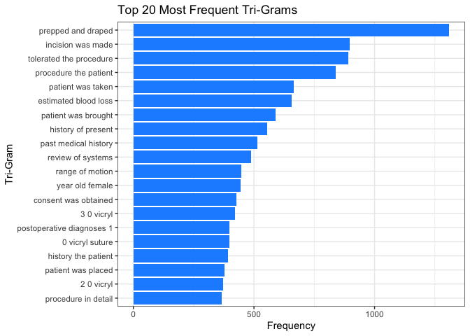

Lab 08 - Text Mining/NLP
================
Rayce Ramsay

# Learning goals

- Use `unnest_tokens()` and `unnest_ngrams()` to extract tokens and
  ngrams from text
- Use dplyr and ggplot2 to analyze and visualize text data
- Try a theme model using `topicmodels`

# Lab description

For this lab we will be working with the medical record transcriptions
from <https://www.mtsamples.com/> available at
<https://github.com/JSC370/JSC370-2025/tree/main/data/medical_transcriptions>.

# Deliverables

1.  Questions 1-7 answered, knit to pdf or html output uploaded to
    Quercus.

2.  Render the Rmarkdown document using `github_document` and add it to
    your github site. Add link to github site in your html.

### Setup packages

You should load in `tidyverse`, (or `data.table`), `tidytext`,
`wordcloud2`, `tm`, and `topicmodels`.

## Read in the Medical Transcriptions

Loading in reference transcription samples from
<https://www.mtsamples.com/>

``` r
library(tidytext)
library(tidyverse)
```

    ## ── Attaching core tidyverse packages ──────────────────────── tidyverse 2.0.0 ──
    ## ✔ dplyr     1.1.4     ✔ readr     2.1.5
    ## ✔ forcats   1.0.0     ✔ stringr   1.5.1
    ## ✔ ggplot2   3.5.1     ✔ tibble    3.2.1
    ## ✔ lubridate 1.9.4     ✔ tidyr     1.3.1
    ## ✔ purrr     1.0.4     
    ## ── Conflicts ────────────────────────────────────────── tidyverse_conflicts() ──
    ## ✖ dplyr::filter() masks stats::filter()
    ## ✖ dplyr::lag()    masks stats::lag()
    ## ℹ Use the conflicted package (<http://conflicted.r-lib.org/>) to force all conflicts to become errors

``` r
library(wordcloud2)
library(tm)
```

    ## Loading required package: NLP
    ## 
    ## Attaching package: 'NLP'
    ## 
    ## The following object is masked from 'package:ggplot2':
    ## 
    ##     annotate

``` r
library(topicmodels)
library(reshape2)
```

    ## 
    ## Attaching package: 'reshape2'
    ## 
    ## The following object is masked from 'package:tidyr':
    ## 
    ##     smiths

``` r
mt_samples <- read_csv("https://raw.githubusercontent.com/JSC370/JSC370-2025/main/data/medical_transcriptions/mtsamples.csv")
```

    ## New names:
    ## Rows: 3682 Columns: 6
    ## ── Column specification
    ## ──────────────────────────────────────────────────────── Delimiter: "," chr
    ## (5): description, medical_specialty, sample_name, transcription, keywords dbl
    ## (1): ...1
    ## ℹ Use `spec()` to retrieve the full column specification for this data. ℹ
    ## Specify the column types or set `show_col_types = FALSE` to quiet this message.
    ## • `` -> `...1`

``` r
mt_samples <- mt_samples |>
  select(description, medical_specialty, transcription)

head(mt_samples)
```

    ## # A tibble: 6 × 3
    ##   description                                    medical_specialty transcription
    ##   <chr>                                          <chr>             <chr>        
    ## 1 A 23-year-old white female presents with comp… Allergy / Immuno… "SUBJECTIVE:…
    ## 2 Consult for laparoscopic gastric bypass.       Bariatrics        "PAST MEDICA…
    ## 3 Consult for laparoscopic gastric bypass.       Bariatrics        "HISTORY OF …
    ## 4 2-D M-Mode. Doppler.                           Cardiovascular /… "2-D M-MODE:…
    ## 5 2-D Echocardiogram                             Cardiovascular /… "1.  The lef…
    ## 6 Morbid obesity.  Laparoscopic antecolic anteg… Bariatrics        "PREOPERATIV…

------------------------------------------------------------------------

## Question 1: What specialties do we have?

We can use `count()` from `dplyr` to figure out how many different
medical specialties are in the data. Are these categories related?
overlapping? evenly distributed? Make a bar plot.

``` r
mt_samples %>%
  count(medical_specialty, sort = TRUE) %>%
  ggplot(aes(x = reorder(medical_specialty, n), y = n)) +
  geom_col(fill = "steelblue") +
  coord_flip() +
  labs(
    title = "Count of Medical Specialties",
    x = "Medical Specialty",
    y = "Number of Transcriptions"
  ) +
  theme_bw()
```

<!-- --> The
categories don’t seem to be related too much. They are not evenly
distributed (surgery has over 1000 while immunology appears to have 0).

------------------------------------------------------------------------

## Question 2: Tokenize

- Tokenize the the words in the `transcription` column
- Count the number of times each token appears
- Visualize the top 20 most frequent words with a bar plot
- Create a word cloud of the top 20 most frequent words

### Explain what we see from this result. Does it makes sense? What insights (if any) do we get?

``` r
tokens <- mt_samples |>
  select(transcription) |>
  unnest_tokens(word, transcription) |>
  group_by(word) |>
  summarize(word_frequency = n()) |>
  arrange(across(word_frequency, desc)) |>
  head(20)

tokens |>
  ggplot(aes(fct_reorder(word, word_frequency), word_frequency)) +
  geom_bar(stat = 'identity', fill = "dodgerblue") +
  coord_flip() +
  labs(
    title = "Top 20 Most Frequent Words",
    x = "Word",
    y = "Frequency"
  ) +
  theme_bw()
```

<!-- -->

``` r
tokens |>
  count(word, sort=TRUE) |>
  wordcloud2(size = 0.5, color = "random-light", backgroundColor = "dodgerblue")
```

<div class="wordcloud2 html-widget html-fill-item" id="htmlwidget-6f6cecdc2fb7cf2902d5" style="width:672px;height:480px;"></div>
<script type="application/json" data-for="htmlwidget-6f6cecdc2fb7cf2902d5">{"x":{"word":["a","and","at","for","he","in","is","no","of","on","patient","right","she","the","then","this","to","was","were","with"],"freq":[1,1,1,1,1,1,1,1,1,1,1,1,1,1,1,1,1,1,1,1],"fontFamily":"Segoe UI","fontWeight":"bold","color":"random-light","minSize":0,"weightFactor":90,"backgroundColor":"dodgerblue","gridSize":0,"minRotation":-0.7853981633974483,"maxRotation":0.7853981633974483,"shuffle":true,"rotateRatio":0.4,"shape":"circle","ellipticity":0.65,"figBase64":null,"hover":null},"evals":[],"jsHooks":{"render":[{"code":"function(el,x){\n                        console.log(123);\n                        if(!iii){\n                          window.location.reload();\n                          iii = False;\n\n                        }\n  }","data":null}]}}</script>

We can see that the most frequent words are stopwords. This is expected
as stopwords by nature are supposed to be the most common. It is hard to
extract much insight from this.

------------------------------------------------------------------------

## Question 3: Stopwords

- Redo Question 2 but remove stopwords
- Check `stopwords()` library and `stop_words` in `tidytext`
- Use regex to remove numbers as well
- Try customizing your stopwords list to include 3-4 additional words
  that do not appear informative

### What do we see when you remove stopwords and then when you filter further? Does it give us a better idea of what the text is about?

``` r
head(stopwords("english"))
```

    ## [1] "i"      "me"     "my"     "myself" "we"     "our"

``` r
length(stopwords("english"))
```

    ## [1] 174

``` r
head(stop_words)
```

    ## # A tibble: 6 × 2
    ##   word      lexicon
    ##   <chr>     <chr>  
    ## 1 a         SMART  
    ## 2 a's       SMART  
    ## 3 able      SMART  
    ## 4 about     SMART  
    ## 5 above     SMART  
    ## 6 according SMART

``` r
custom_stopwords <- c("mm", "mg", "also", "using")

tokens <- mt_samples |>
  select(transcription) |>
  unnest_tokens(word, transcription) |>
  filter(!word %in% stopwords("en"),
         !word %in% custom_stopwords,
         !str_detect(word, "^[0-9]+$")) |> 
  count(word, sort = TRUE) |>
  slice_head(n = 20)

tokens |>
  ggplot(aes(x = fct_reorder(word, n), y = n)) +
  geom_col(fill = "dodgerblue") +
  coord_flip() +
  labs(
    title = "Top 20 Words (Without Stopwords & Numbers)",
    x = "Word",
    y = "Frequency"
  ) +
  theme_bw()
```

<!-- -->

``` r
tokens |>
  count(word, sort=TRUE) |>
  wordcloud2(size = 0.4, color = "random-light", backgroundColor = "dodgerblue")
```

<div class="wordcloud2 html-widget html-fill-item" id="htmlwidget-4830247266d6a5eee59c" style="width:672px;height:480px;"></div>
<script type="application/json" data-for="htmlwidget-4830247266d6a5eee59c">{"x":{"word":["anesthesia","blood","diagnosis","history","incision","left","normal","noted","pain","patient","performed","placed","procedure","removed","right","room","skin","time","used","well"],"freq":[1,1,1,1,1,1,1,1,1,1,1,1,1,1,1,1,1,1,1,1],"fontFamily":"Segoe UI","fontWeight":"bold","color":"random-light","minSize":0,"weightFactor":72,"backgroundColor":"dodgerblue","gridSize":0,"minRotation":-0.7853981633974483,"maxRotation":0.7853981633974483,"shuffle":true,"rotateRatio":0.4,"shape":"circle","ellipticity":0.65,"figBase64":null,"hover":null},"evals":[],"jsHooks":{"render":[{"code":"function(el,x){\n                        console.log(123);\n                        if(!iii){\n                          window.location.reload();\n                          iii = False;\n\n                        }\n  }","data":null}]}}</script>

After removing stopwords, we can see that there are a lot of medical
terms in the transcriptions. This suggests that the text probably has to
do with medical related topics.

------------------------------------------------------------------------

## Question 4: ngrams

Repeat question 2, but this time tokenize into bi-grams. How does the
result change if you look at tri-grams? Note we need to remove stopwords
a little differently. You don’t need to recreate the wordclouds.

``` r
stopwords2 <- c(stopwords("en"), "mm", "mg", "also", "using")

sw_start <- paste0("^", paste(stopwords2, collapse=" |^"), "$")
sw_end <- paste0("", paste(stopwords2, collapse="$| "), "$")

tokens_bigram <- mt_samples |>
  select(transcription) |>
  unnest_tokens(ngram, transcription, token = "ngrams", n = 2) |>
  filter(!str_detect(ngram, "^[0-9]+$"))|>
  filter(!str_detect(ngram, sw_start))|>
  filter(!str_detect(ngram, sw_end))|>
  count(ngram, sort = TRUE)
```

``` r
tokens_bigram20 <- tokens_bigram |> head(20)

tokens_bigram20 |>
  ggplot(aes(x = fct_reorder(ngram, n), y = n)) +
  geom_col(fill = "dodgerblue") +
  coord_flip() +
  labs(
    title = "Top 20 Most Frequent Bi-Grams",
    x = "Bi-Gram",
    y = "Frequency"
  ) +
  theme_bw()
```

<!-- -->

``` r
tokens_trigram <- mt_samples |>
  select(transcription) |>
  unnest_tokens(ngram, transcription, token = "ngrams", n = 3) |>
  filter(!str_detect(ngram, "^[0-9]+$"))|>
  filter(!str_detect(ngram, sw_start))|>
  filter(!str_detect(ngram, sw_end))|>
  count(ngram, sort = TRUE)
```

``` r
tokens_trigram20 <- tokens_trigram |> head(20)

tokens_trigram20 |>
  ggplot(aes(x = fct_reorder(ngram, n), y = n)) +
  geom_col(fill = "dodgerblue") +
  coord_flip() +
  labs(
    title = "Top 20 Most Frequent Tri-Grams",
    x = "Tri-Gram",
    y = "Frequency"
  ) +
  theme_bw()
```

<!-- -->

We seem to get phrases that can be understood out of context better when
we look at tri-grams versus bi-grams.

------------------------------------------------------------------------

## Question 5: Examining words

Using the results from the bigram, pick a word and count the words that
appear before and after it, and create a plot of the top 20.

``` r
library(stringr)

word_of_interest <- "patient"

tokens_bigram_filtered <- tokens_bigram |>
  filter(str_detect(ngram, paste0("\\b", word_of_interest, "\\b"))) |>
  mutate(
    word = str_remove(ngram, paste0("\\b", word_of_interest, "\\b")), 
    word = str_remove_all(word, "\\s")
  ) |>
  count(word, sort = TRUE) |>
  head(20)

tokens_bigram_filtered$word <- as.character(tokens_bigram_filtered$word)

tokens_bigram_filtered |>
  ggplot(aes(x = fct_reorder(word, n), y = n)) +
  geom_col(fill = "dodgerblue") +
  coord_flip() +
  labs(
    title = paste0("Top 20 Words Appearing Before or After '", word_of_interest, "'"),
    x = paste0("Word appearing with '", word_of_interest, "'"),
    y = "Frequency"
  ) +
  theme_bw()
```

<!-- -->

------------------------------------------------------------------------

## Question 6: Words by Specialties

Which words are most used in each of the specialties? You can use
`group_by()` and `top_n()` from `dplyr` to have the calculations be done
within each specialty. Remember to remove stopwords. How about the 5
most used words?

``` r
top_words_by_specialty <- mt_samples |>
  unnest_tokens(word, transcription) |>
  filter(
    !word %in% stopwords2, 
    !str_detect(word, "^[0-9]+$")
  ) |>
  count(medical_specialty, word, sort = TRUE) |>
  group_by(medical_specialty) |>
  slice_max(n, n = 5) |>  
  ungroup() |>
  arrange(medical_specialty, -n)

top_words_by_specialty
```

    ## # A tibble: 169 × 3
    ##    medical_specialty    word             n
    ##    <chr>                <chr>        <int>
    ##  1 Allergy / Immunology allergies        4
    ##  2 Allergy / Immunology used             4
    ##  3 Allergy / Immunology allegra          3
    ##  4 Allergy / Immunology clear            3
    ##  5 Allergy / Immunology prescription     3
    ##  6 Allergy / Immunology sprays           3
    ##  7 Bariatrics           patient         29
    ##  8 Bariatrics           history         21
    ##  9 Bariatrics           placed          21
    ## 10 Bariatrics           abdomen         20
    ## # ℹ 159 more rows

We can view the most common words in each speciality using the table
above. For example, the most commonly used word in the “Allergy”
category is “allergies” while the most common word in the “Bariatrics”
category is patient.

``` r
top_words <- mt_samples |>
  unnest_tokens(word, transcription) |>
  filter(
    !word %in% stopwords2, 
    !str_detect(word, "^[0-9]+$")
  ) |>
  count(word, sort = TRUE) |>
  arrange(-n) |>
  head(5)
top_words
```

    ## # A tibble: 5 × 2
    ##   word          n
    ##   <chr>     <int>
    ## 1 patient   14971
    ## 2 right      8540
    ## 3 left       8026
    ## 4 procedure  6214
    ## 5 placed     6052

The top 5 most used words (regardless of category) are “patient”,
“right”, “left”, “procedure”, and “placed.”

## Question 7: Topic Models

See if there are any themes in the data by using a topic model (LDA).

- you first need to create a document term matrix
- then you can try the LDA function in `topicmodels`. Try different k
  values.
- create a facet plot of the results from the LDA (see code from
  lecture)

``` r
transcripts_dtm <- mt_samples |>
  select(transcription) |>
  unnest_tokens(word, transcription) |>
  anti_join(stop_words, by="word") |>
  filter(!str_detect(word, "^[0-9]+$"),
         !word %in% c("mm", "mg", "also", "using")) |>
  DocumentTermMatrix()
    
transcripts_dtm <- as.matrix(transcripts_dtm) 

transcripts_lda <- LDA(transcripts_dtm, k=5, control = list(seed=1234))
transcripts_lda
```

    ## A LDA_VEM topic model with 5 topics.

``` r
transcripts_tope_terms <- 
  tidy(transcripts_lda, matrix = "beta") |>
  filter(!str_detect(term, "^[0-9]+$")) |>
  group_by(topic) |>
  slice_max(beta, n=10) |>
  ungroup() |>
  arrange(topic, -beta)

transcripts_tope_terms |> 
  mutate(term=reorder_within(term, beta, topic)) |>
  ggplot(aes(beta, term, fill=factor(topic)))+
  geom_col(show.legend=FALSE)+
  facet_wrap(~topic, scales="free")+
  scale_y_reordered()+
  theme_bw()
```

<!-- -->
