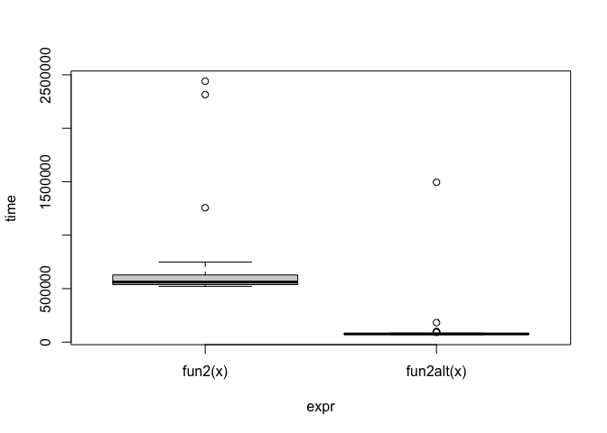
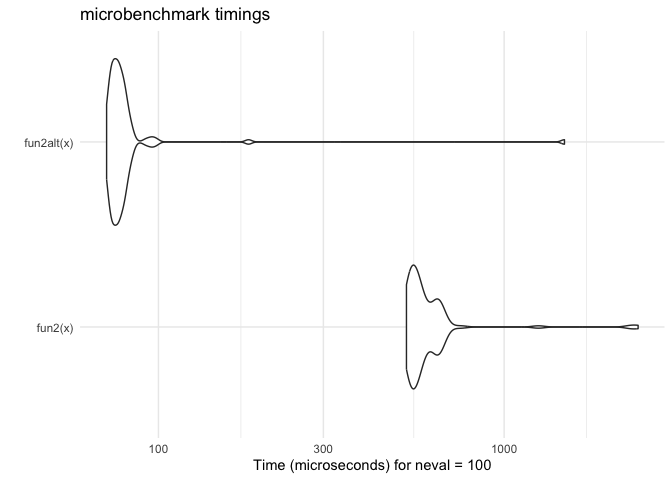

Lab 9 - HPC
================
Rayce Ramsay

# Learning goals

In this lab, you are expected to practice the following skills:

- Evaluate whether a problem can be parallelized or not.
- Practice with the parallel package.
- Use Rscript to submit jobs.

``` r
library(parallel)
library(microbenchmark)
library(tidyverse)
```

    ## ── Attaching core tidyverse packages ───────────────────────────────────────────────────────────────────────────── tidyverse 2.0.0 ──
    ## ✔ dplyr     1.1.4     ✔ readr     2.1.5
    ## ✔ forcats   1.0.0     ✔ stringr   1.5.1
    ## ✔ ggplot2   3.5.1     ✔ tibble    3.2.1
    ## ✔ lubridate 1.9.4     ✔ tidyr     1.3.1
    ## ✔ purrr     1.0.4     
    ## ── Conflicts ─────────────────────────────────────────────────────────────────────────────────────────────── tidyverse_conflicts() ──
    ## ✖ dplyr::filter() masks stats::filter()
    ## ✖ dplyr::lag()    masks stats::lag()
    ## ℹ Use the conflicted package (<http://conflicted.r-lib.org/>) to force all conflicts to become errors

## Problem 1

Give yourself a few minutes to think about what you learned about
parallelization. List three examples of problems that you believe may be
solved using parallel computing, and check for packages on the HPC CRAN
task view that may be related to it.

1.  Markov Chain Monte Carlo: `rstan` can be used for Bayesian
    modelling, while `RcppParallel` can be used for parallel mcmc
    sampling

2.  Image Denoising: `mclapply` and `parLapply` can be used for
    parallelized loop ops

3.  Cross-Validation in machine learning: supported by `doParallel`

## Problem 2: Pre-parallelization

The following functions can be written to be more efficient without
using `parallel`:

1.  This function generates a `n x k` dataset with all its entries
    having a Poisson distribution with mean `lambda`.

``` r
fun1 <- function(n = 100, k = 4, lambda = 4) {
  x <- NULL
  
  for (i in 1:n)
    x <- rbind(x, rpois(k, lambda))
  
  return(x)
}

fun1alt <- function(n = 100, k = 4, lambda = 4) {
  matrix(rpois(n * k, lambda), nrow = n, ncol = k)
}

# Benchmarking
microbenchmark::microbenchmark(
  fun1(),
  fun1alt()
)
```

    ## Warning in microbenchmark::microbenchmark(fun1(), fun1alt()): less accurate
    ## nanosecond times to avoid potential integer overflows

    ## Unit: microseconds
    ##       expr     min      lq      mean  median       uq      max neval
    ##     fun1() 119.597 123.123 141.28641 126.403 129.6215 1416.181   100
    ##  fun1alt()  13.202  13.694  23.27283  14.145  14.6985  840.254   100

How much faster?

The alternative implementation is roughly 7 times faster on average.

2.  Find the column max (hint: Checkout the function `max.col()`).

``` r
# Data Generating Process (10 x 10,000 matrix)
set.seed(1234)
x <- matrix(rnorm(1e4), nrow=10)

# Find each column's max value
# Inefficient because it uses apply() which loops through each column giving a slower function.
fun2 <- function(x) {
  apply(x, 2, max)
}

# Avoids loops and directly extracts max value
fun2alt <- function(x) {
  x[cbind(max.col(t(x)), 1:ncol(x))]
}

# Benchmarking
bench = microbenchmark::microbenchmark(
  fun2(x),
  fun2alt(x),
  unit = "us"
)
bench
```

    ## Unit: microseconds
    ##        expr     min       lq      mean  median       uq      max neval
    ##     fun2(x) 521.684 537.8790 619.84046 561.536 628.0995 2440.689   100
    ##  fun2alt(x)  70.807  73.4515  92.27296  76.260  79.6630 1494.409   100

*Answer here with a plot.*

``` r
plot(bench)
```

<!-- -->

``` r
autoplot(bench) + 
  theme_minimal()
```

<!-- -->

## Problem 3: Parallelize everything

We will now turn our attention to non-parametric
[bootstrapping](https://en.wikipedia.org/wiki/Bootstrapping_(statistics)).
Among its many uses, non-parametric bootstrapping allow us to obtain
confidence intervals for parameter estimates without relying on
parametric assumptions.

The main assumption is that we can approximate many experiments by
resampling observations from our original dataset, which reflects the
population.

This function implements the non-parametric bootstrap:

``` r
my_boot <- function(dat, stat, R, ncpus = 1L) {
  
  # Getting the random indices
  n <- nrow(dat)
  idx <- matrix(sample.int(n, n*R, TRUE), nrow=n, ncol=R)
 
  # Making the cluster using `ncpus`
  # STEP 1: GOES HERE
    # ncpus specify that we are using multiple CPU cores
    # PSOCK for parallel socket cluster
  cl = makePSOCKcluster(ncpus)
  # on.exit(stopCluster(cl)) # makes the clusters automatically shutdown to prevent memory leak
  
  # STEP 2: GOES HERE
  clusterExport(cl, varlist = c("dat", "stat", "idx"), envir = environment())
  
  # STEP 3: THIS FUNCTION NEEDS TO BE REPLACED WITH parLapply
  # ans <- lapply(seq_len(R), function(i) {
  #   stat(dat[idx[,i], , drop=FALSE])
  # })
  ans = parLapply(cl, seq_len(R), function(i) {
    stat(dat[idx[, i], , drop = FALSE])
  })
  
  # Coercing the list into a matrix
  ans <- do.call(rbind, ans)
  
  # STEP 4: GOES HERE
  stopCluster(cl)
  
  ans
  
}
```

1.  Use the previous pseudocode, and make it work with `parallel`. Here
    is just an example for you to try:

``` r
# Bootstrap of a linear regression model
# my_stat <- function_for_lm 
my_stat = function(d) coef(lm(y~x, data = d))

# DATA SIM
set.seed(1)
n <- 500 
R <- 1e4
x <- cbind(rnorm(n)) 
y <- x*5 + rnorm(n)

# Check if we get something similar as lm
ans0 <- confint(lm(y~x))
ans1 <- my_boot(dat = data.frame(x, y), my_stat, R=R, ncpus = 4)
qs <- c(.025, .975)

cat("Ordinary Least Squares: \n")
```

    ## Ordinary Least Squares:

``` r
print(ans0)
```

    ##                  2.5 %     97.5 %
    ## (Intercept) -0.1379033 0.04797344
    ## x            4.8650100 5.04883353

``` r
cat("\n")
```

``` r
cat("Bootstrap CI: \n")
```

    ## Bootstrap CI:

``` r
print(t(apply(ans1, 2, quantile, probs = qs)))
```

    ##                   2.5%      97.5%
    ## (Intercept) -0.1386903 0.04856752
    ## x            4.8685162 5.04351239

2.  Check whether your version actually goes faster than the
    non-parallel version:

``` r
parallel::detectCores()
```

    ## [1] 8

``` r
system.time(my_boot(dat = data.frame(x, y), my_stat, R= 4000, ncpus = 1L))
```

    ##    user  system elapsed 
    ##   0.032   0.006   1.260

``` r
system.time(my_boot(dat = data.frame(x, y), my_stat, R= 4000, ncpus = 8L))
```

    ##    user  system elapsed 
    ##   0.114   0.036   0.635

## Problem 4: Compile this markdown document using Rscript

Once you have saved this Rmd file, try running the following command in
your terminal:

``` bash
Rscript --vanilla -e 'rmarkdown::render("[full-path-to-your-Rmd-file.Rmd]")' &
```

Where `[full-path-to-your-Rmd-file.Rmd]` should be replace with the full
path to your Rmd file… :).
